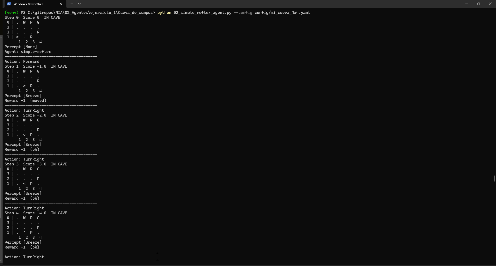
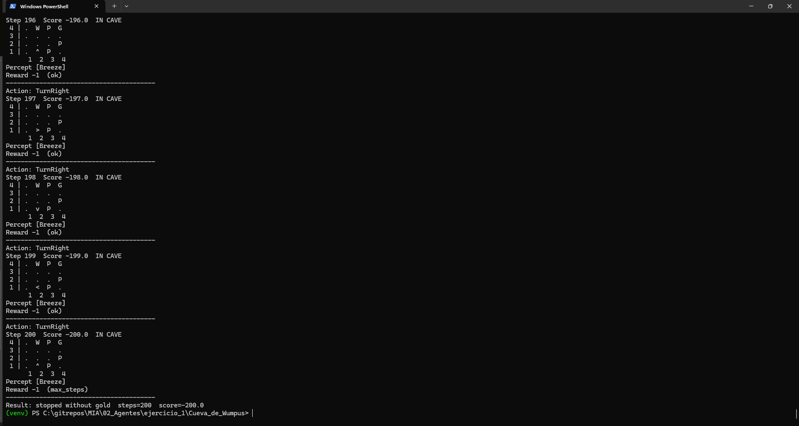
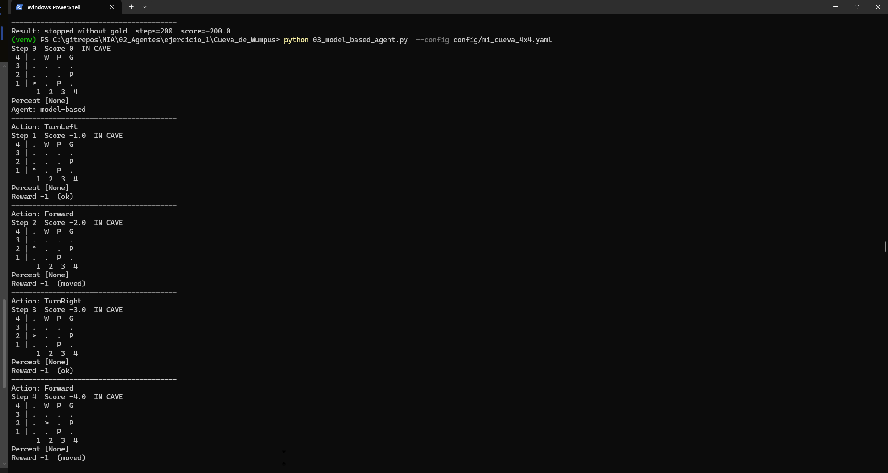
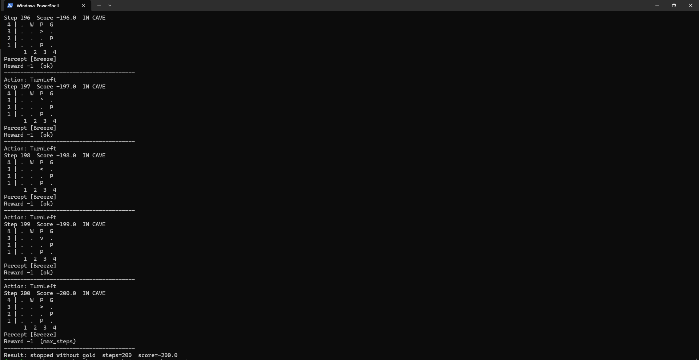
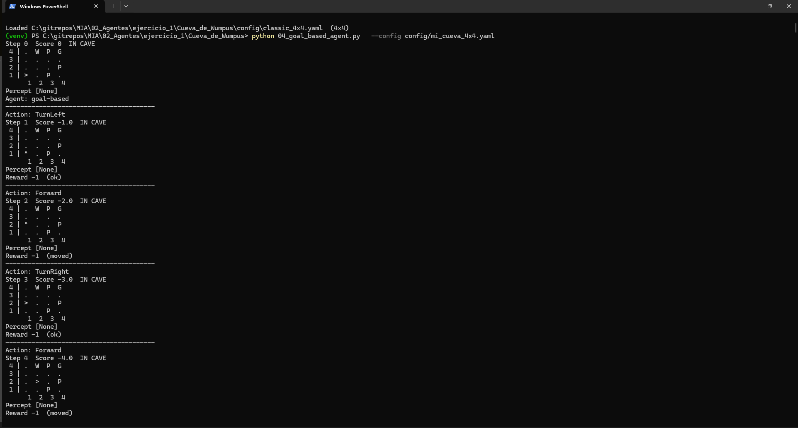
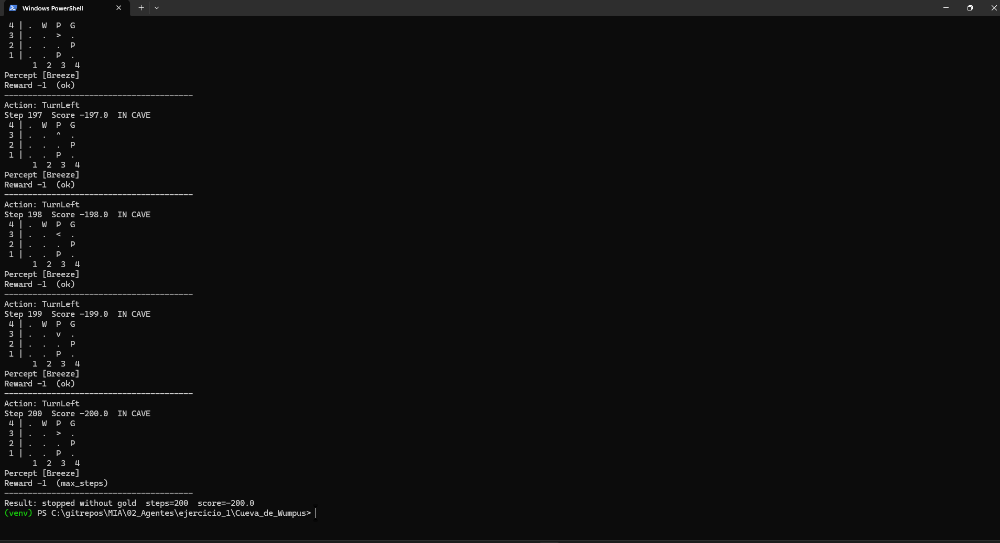
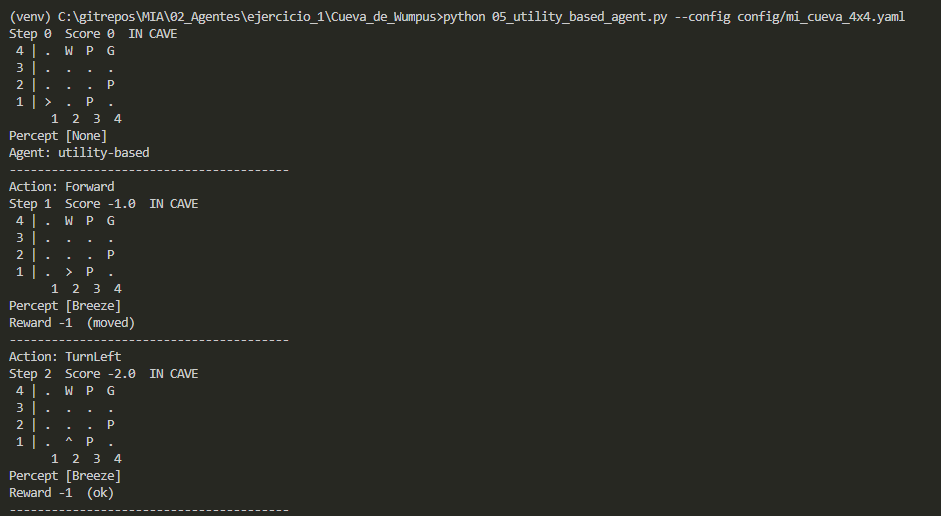
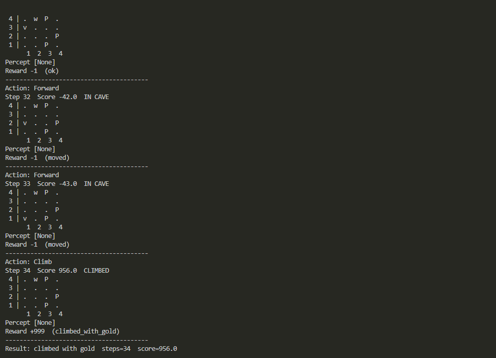
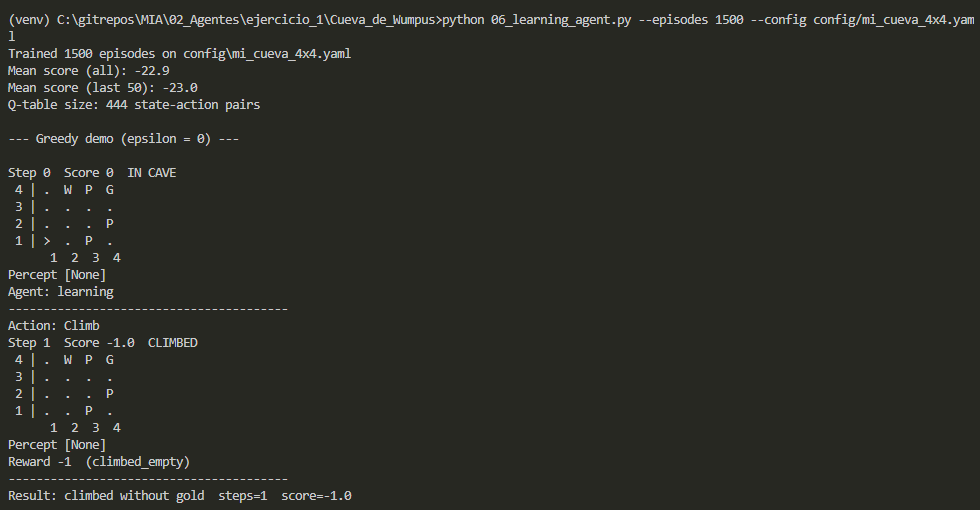

# Evidencias

## 02. Simple Reflex Agent

### Ejecución

### Resultado

## 03. Model Based Agent

### Ejecución

### Resultado

## 04. Goal Based Agent

### Ejecución

### Resultado

## 05. Utility Based Agent

### Ejecución

### Resultado

## 06. Learning Agent

