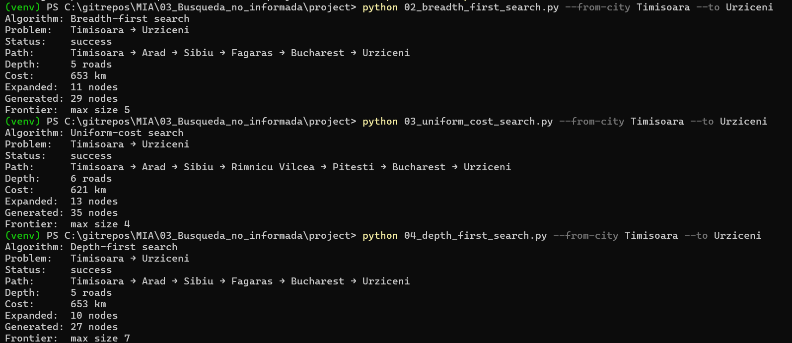
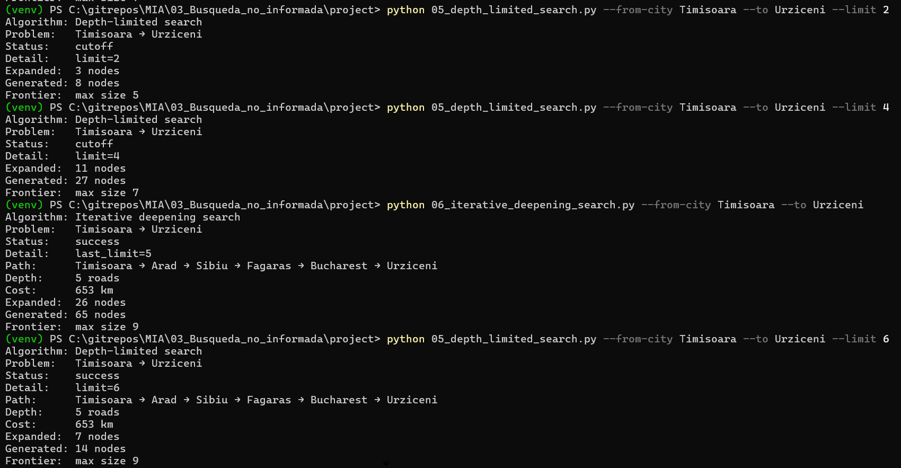
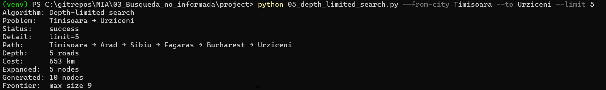

# Entrega — Ejercicio 1: Comparar BFS, UCS, DFS, DLS e IDS en el mapa de Rumania

## Pareja origen–destino elegida

**Timisoara → Urziceni**

## Subgrafo relevante

```
Timisoara
   │ 118
  Arad
   │ 140
  Sibiu
   ├────────────┐
   │ 80         │ 99
  Rimnicu     Fagaras
  Vilcea        │ 211
   │ 97         │
  Pitesti       │
   │ 101        │
   └─────┬──────┘
         │
     Bucharest
         │ 85
     Urziceni
```

| Tramo | km |
|---|---|
| Timisoara – Arad | 118 |
| Arad – Sibiu | 140 |
| Sibiu – Fagaras | 99 |
| Sibiu – Rimnicu Vilcea | 80 |
| Rimnicu Vilcea – Pitesti | 97 |
| Fagaras – Bucharest | 211 |
| Pitesti – Bucharest | 101 |
| Bucharest – Urziceni | 85 |

## Tabla comparativa

| Algoritmo | Status | Ruta | Depth | Cost (km) | Expanded | Generated |
|---|---|:---:|:---:|:---:|:---:|:---:|
| BFS | ✅ success | A | 5 | 653 | 11 | 29 |
| UCS | ✅ success | B | 6 | 621 | 13 | 35 |
| DFS | ✅ success | A | 5 | 653 | 10 | 27 |
| DLS `--limit 2` | ⛔ cutoff | — | — | — | 3 | 8 |
| DLS `--limit 4` | ⛔ cutoff | — | — | — | 11 | 27 |
| DLS `--limit 5` | ✅ success | A | 5 | 653 | 5 | 10 |
| DLS `--limit 6` | ✅ success | A | 5 | 653 | 7 | 14 |
| IDS | ✅ success | A | 5 | 653 | 26 | 65 |

**Rutas:**
- **A:** Timisoara → Arad → Sibiu → Fagaras → Bucharest → Urziceni
- **B:** Timisoara → Arad → Sibiu → Rimnicu Vilcea → Pitesti → Bucharest → Urziceni

## Reporte

- ¿BFS encontró el camino con menos carreteras? ¿UCS el de menos km? 

Si, Breadth First Search tenía un camino de 5 caminos, pero tenia un mayor costo; esto es porque el objetivo de BFS es minimizar la profundidad. En cambio, Uniform-cost search llegó al destino en 6 caminos, pero con menor costo, esto es porque se expande al nodo de menor costo en la frontera. Este fue un caso en el que la ruta con menos caminos no fue la más barata.
- ¿Por qué DFS puede devolver un camino más largo aunque el grafo sea el mismo?

Como Depth-first search no toma en cuenta el costo o la profundidad, este explora por una rama hasta el fondo y se detiene si se llega a la solución, esto es sin tomar en cuenta alternativas. En este caso el orden en el que se explora la rama es en orden alfabético. Por lo que esto no garantizaba obtener el camino más corto o de menor costo.
- ¿Con qué `--limit` DLS pasó de `cutoff` a solución, y cómo se relaciona eso con la profundidad del camino de BFS/IDS?

Depth-limited search pasó de "cutoff" a "success" con un límite de 5; cuando era límite 2 y 4 se quedaba corto, pero con el límite 5 sí llegaba a la solución, que fue lo mismo que se obtuvo con BFS e IDS (5 caminos). En el caso de BFS e IDS ya sabiamos que encontró la ruta en 5 caminos así que se pudo tomar como pista para saber que la profundidad óptima era 5, en vez de estar probando con los límites.


## Evidencias






