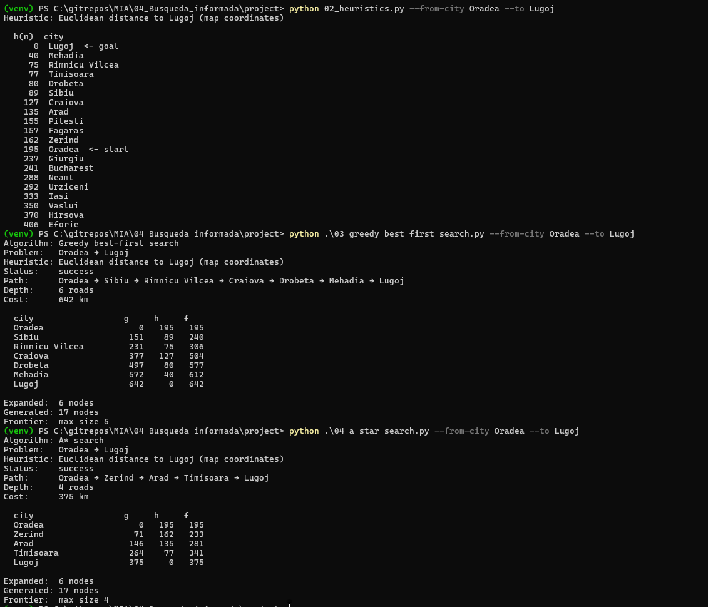

# Entrega — Ejercicio 1: Comparar Greedy y A* en el mapa de Rumania

## Pareja origen–destino elegida

**Oradea → Lugoj**

## Subgrafo relevante

Desde Oradea salen dos ramas hacia Lugoj; cada algoritmo sigue una distinta:

```
Rama de A* (óptima, 375 km)          Rama de Greedy (642 km)

Oradea (h=195)  <- start             Oradea (h=195)  <- start
   │71                                  │151
Zerind (h=162)                       Sibiu (h=89)
   │75                                  │80
Arad (h=135)                         Rimnicu Vilcea (h=75)
   │118                                 │146
Timisoara (h=77)                     Craiova (h=127)
   │111                                 │120
Lugoj (h=0)  <- goal                 Drobeta (h=80)
                                         │75
                                      Mehadia (h=40)
                                         │70
                                      Lugoj (h=0)  <- goal
```


## Heurística h(n) hacia Lugoj (extracto de `02_heuristics.py`)

| h(n) | Ciudad |
|---:|---|
| 0 | Lugoj (goal) |
| 40 | Mehadia |
| 75 | Rimnicu Vilcea |
| 77 | Timisoara |
| 80 | Drobeta |
| 89 | Sibiu |
| 127 | Craiova |
| 135 | Arad |
| 162 | Zerind |
| 195 | Oradea (start) |

## Tabla comparativa

| Algoritmo | Status | Ruta | Depth | Cost (km) | Expanded | Generated | Frontier máx. |
|---|---|:---:|:---:|:---:|:---:|:---:|:---:|
| Greedy best-first | ✅ success | B | 6 | 642 | 6 | 17 | 5 |
| A* | ✅ success | A | 4 | 375 | 6 | 17 | 4 |

**Ruta A (A*, óptima):** Oradea → Zerind → Arad → Timisoara → Lugoj
**Ruta B (Greedy):** Oradea → Sibiu → Rimnicu Vilcea → Craiova → Drobeta → Mehadia → Lugoj

### Tabla g / h / f — Greedy (Ruta B)

| Ciudad | g | h | f |
|---|---:|---:|---:|
| Oradea | 0 | 195 | 195 |
| Sibiu | 151 | 89 | 240 |
| Rimnicu Vilcea | 231 | 75 | 306 |
| Craiova | 377 | 127 | 504 |
| Drobeta | 497 | 80 | 577 |
| Mehadia | 572 | 40 | 612 |
| Lugoj | 642 | 0 | 642 |

### Tabla g / h / f — A* (Ruta A)

| Ciudad | g | h | f |
|---|---:|---:|---:|
| Oradea | 0 | 195 | 195 |
| Zerind | 71 | 162 | 233 |
| Arad | 146 | 135 | 281 |
| Timisoara | 264 | 77 | 341 |
| Lugoj | 375 | 0 | 375 |

## Reporte

- **¿A* encontró el camino de menos km? ¿Greedy coincidió o se desvió?**

Sí, A* encontró el camino de menos km (375 km en A* y 642 km en Greedy), el punto en el que Greedy se desvió fue en Oradea ya que intentó recorrer el camino que contaba con la menor heurística pero terminó costando más su ruta una vez que llegó a su destino. Por lo tanto, A* fue mejor en esta situación en comparación con Greedy.

- **¿Por qué Greedy puede devolver un camino más caro aunque `h` sea admisible?**

Como el criterio de Greedy es únicamente la h comparó la heurística de Sibiu 89 y la heurística de Zerind 162, y como Sibiu es menor entonces decide tomar ese camino. En el caso de A* utiliza f(n) que es la suma de g(n) y h(n) lo cual para Sibiu es 240 y en el caso de Zerind fue 233 por lo que se decidió ir por Zerind. Es por eso que Greedy se desvió y A* logró encontrar el camino con menor costo.

- **En el camino de A*, ¿`f` tiende a no disminuir a lo largo de la ruta?**

f no disminuye lo largo de la ruta (195, 233, 281, 341, 375), esto es porque la heurística es consistente mediante la desigualdad h(n) ≤ c(n, a, n′) + h(n′), por lo que nos garantiza que se encuentre el camino óptimo y se descarten las rutas que puedan resultar más costosas.

## Evidencias


