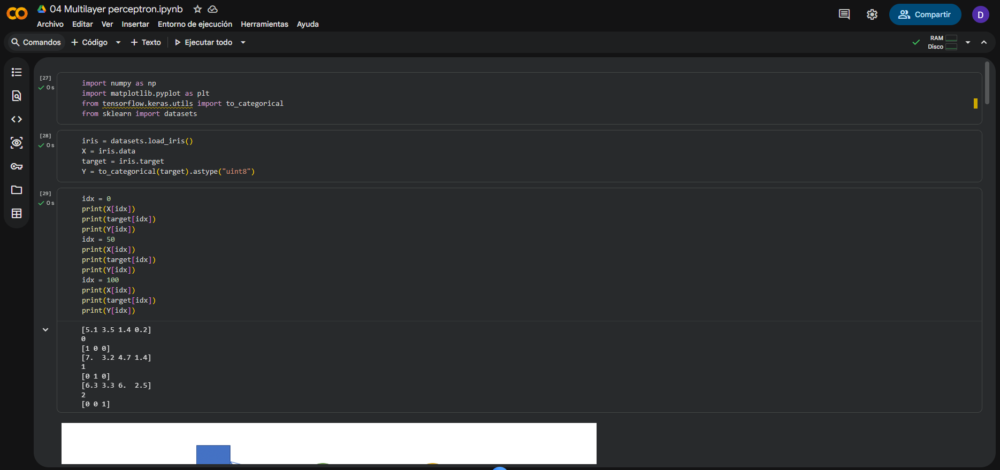
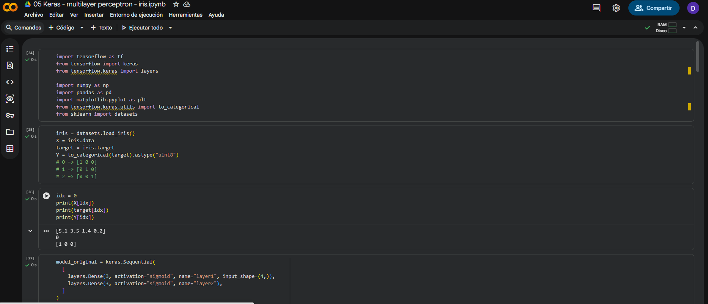
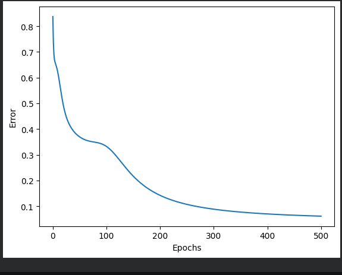
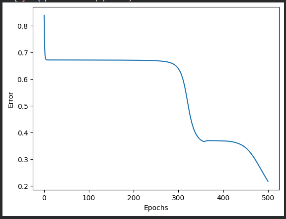
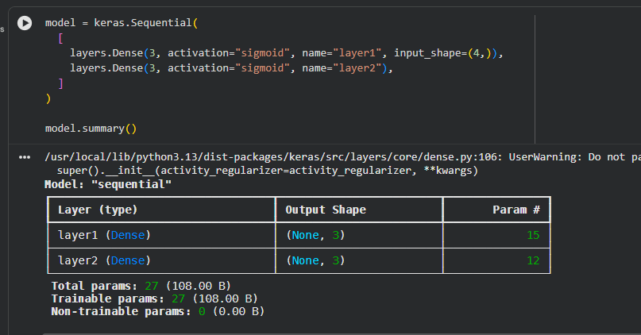
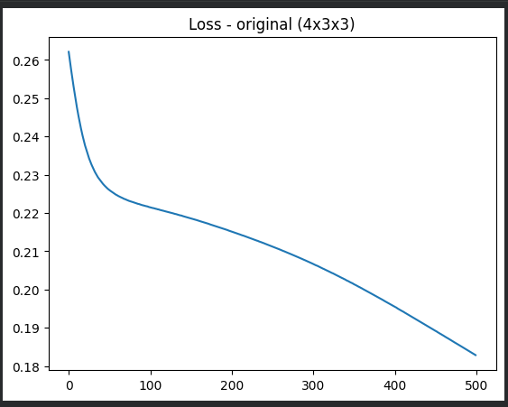
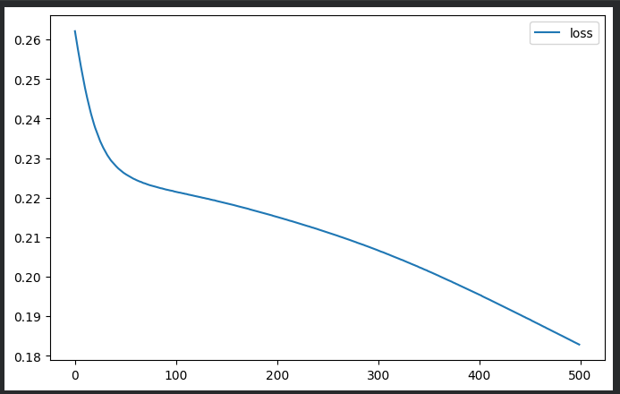
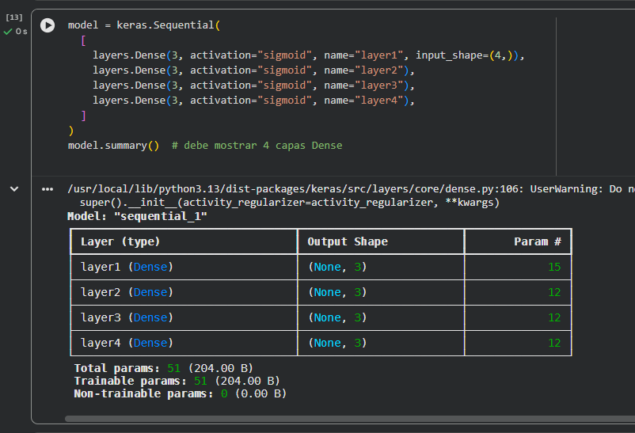
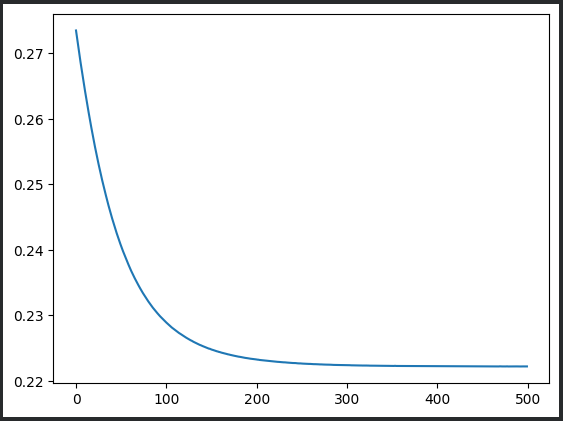
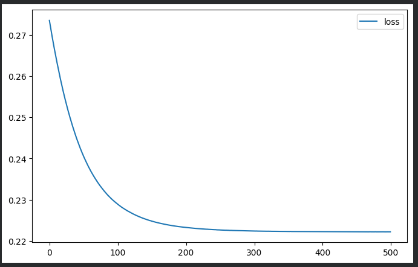

# Entrega — Ejercicio 1: Más capas en el perceptrón multicapa (Iris)

## 1. Enlaces de Colab

- Notebook 01 (NumPy — a mano): `https://colab.research.google.com/drive/1JkaCucCoKHtiRySCfTHUFJnkudZvcd-Z?usp=sharing`
- Notebook 02 (Keras): `https://colab.research.google.com/drive/1h512pGSCthoWlFuOCwCiq_KmFEfL23Rc?usp=sharing`

## 2. Evidencia de ejecución en Colab

## 3. Evidencias — Implementación a mano (NumPy)

### 3.1 Topología original (4x3x3)

### 3.2 Topología profunda (4x3x3x3x3)

## 4. Evidencias — Implementación en Keras

### 4.1 Topología original (4x3x3)

### 4.2 Topología profunda (4x3x3x3x3)

## 5. Reporte

### 5.1 ¿Bajó más el error al añadir dos capas, o se estancó / empeoró? ¿Igual en NumPy y en Keras?

El error al añadir dos capas empeoró en ambos casos. En NumPy el error final antes de los cambios fue de 0.05 aproximadamente; después de los cambios pasó a 0.22 aproximadamente. En Keras el error final original fue de 0.183 aproximadamente, y con los cambios pasó a 0.222 aproximadamente, por lo que la implementación de las dos capas no fue favorable.

### 5.2 ¿Las curvas de la notebook 01 y de Keras se parecen con la misma topología? Si no, ¿qué diferencias de implementación podrían explicarlo?

La curva de Numpy presenta un descenso de errores de tal forma que parece un escalón, mientras que con Keras es una curva más suave. La razón de esto puede ser por la forma en la que se corrige el error por época; esto se puede respaldar por la forma en la que las gráficas se comportan conforme progresan las épocas.

### 5.3 Con sigmoides apiladas y MSE, ¿tiene sentido que una red más profunda no aprenda mejor en Iris?

Sí, esto es porque al agregar más capas en ambas implementaciones se presentó un error mayor, y específicamente en el caso de Numpy podemos ver que tardó más épocas en hacer los ajustes necesarios para reducir el error, además de no terminar con un error mínimo menor. La razón de esto es debido a que en backprop, si se utilizan sigmoides apilados el delta se puede hacer muy chico, en otras palabras, el gradiente se desvanece. Lo que ocasiona un mayor error.