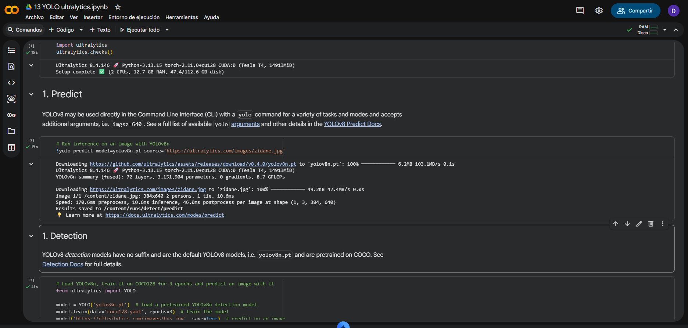
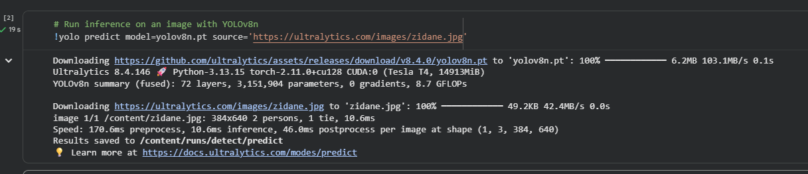
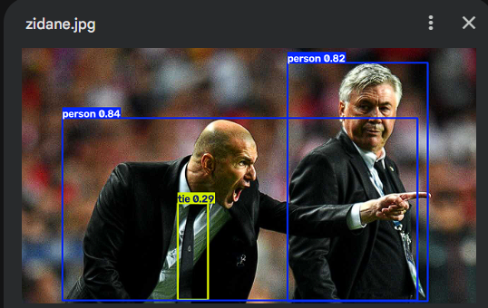
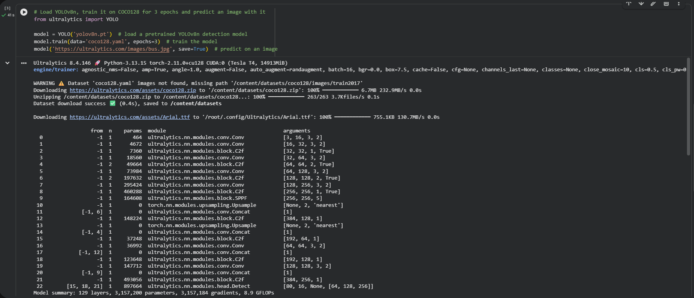
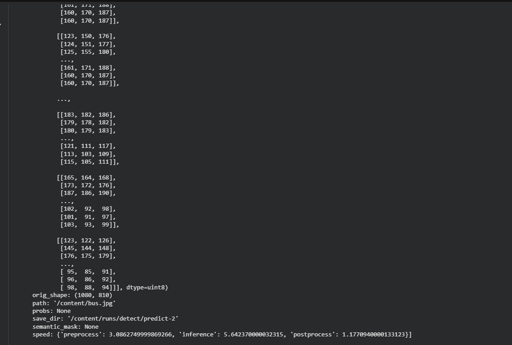
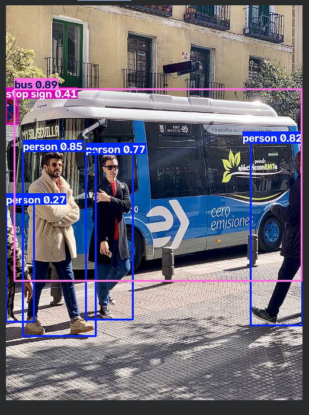
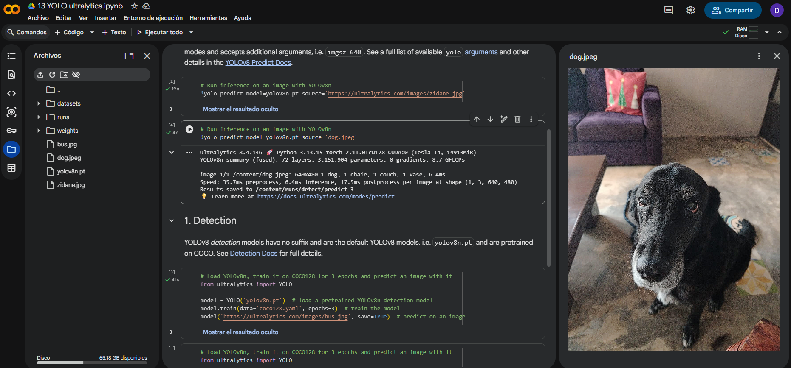
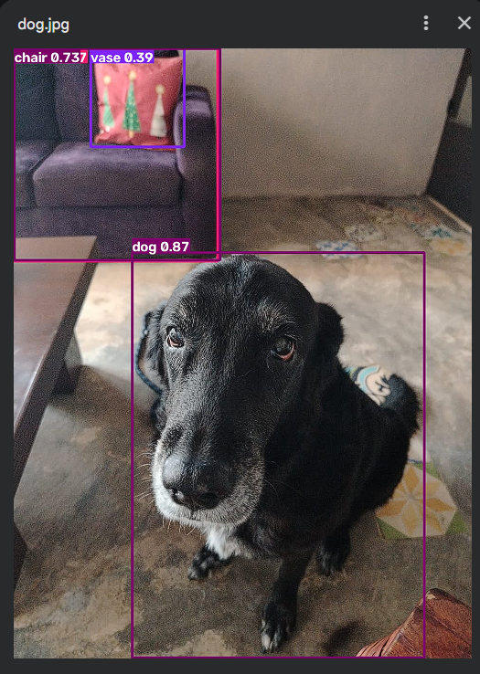
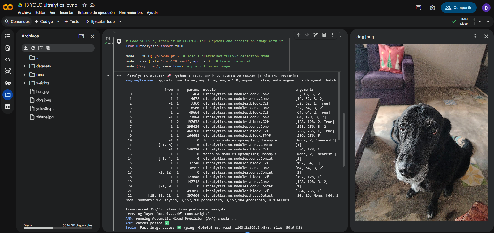
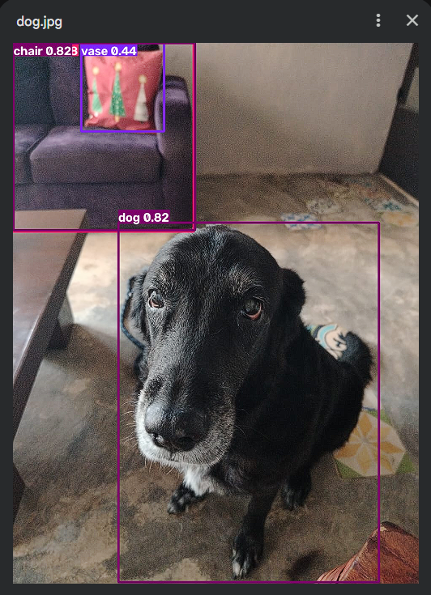

# Entrega — Ejercicio 1: Cambiar la imagen de predicción en YOLO

## 1. Enlace de Colab

- Notebook `13 YOLO ultralytics.ipynb`: `https://colab.research.google.com/drive/1G832U_pMylO3woP01y74P7Xd7j3APZIO?usp=sharing`

## 2. Evidencia de ejecución en Colab (entorno)

## 3. Evidencias — Corrida original (zidane.jpg y bus.jpg)

### 3.1 zidane.jpg

### 3.2 bus.jpg (entrenamiento + predicción)

## 4. Evidencias — Predicción sobre imagen propia (dog.jpeg)

### 4.1 Celda CLI (`!yolo predict ...`)

### 4.2 Celda Python (`model('dog.jpeg', save=True)`, reentrenada 3 épocas)

## 5. Reporte

### 5.1 ¿Qué clases detectó YOLO en las fotos de Ultralytics y cuáles en la tuya?

En la imagen de zidane.jpg YOLO detectó 2 personas y una corbata, en bus.jpg detectó 1 autobus, 1 signo de alto y 4 personas. En el caso de la imagen propia YOLO detectó 1 silla, 1 florero y 1 perro.

### 5.2 ¿Algún objeto evidente de tu foto no salió etiquetado? ¿Por qué podría pasar?

Sí, no etiquetó correctamente una almohada o cojín, lo confundió con un florero o jarrón; en el caso de lo que fue etiquetado como una silla en realidad es un sillón o sofá. Aparte de eso, los demás objetos que no logró etiquetar aparecen parcialmente en la imagen, como es el caso de una puerta y una mesa.

### 5.3 ¿La predicción de la celda CLI y la de `model(...)` coinciden sobre tu misma imagen?

Sí, coinciden con el etiquetado, pero caen en los mismos errores, lo principal de la imagen que es el perro fue claramente etiquetado, pero su confianza disminuyó un poco; en el caso del sofá tuvo más confianza en ser etiquetado como silla. Además, el cojín siguió etiquetado como un florero o jarrón.
