# Entrega — Ejercicio 1: Separar los blobs y volver a elegir k

## 1. Enlace de Colab

- Notebook: [https://colab.research.google.com/drive/1uXQiNeoGCns0u3o41swSCfE9Qwe5pX65?usp=sharing]


## 2. Centros y desviaciones usados

**Original:**

```python
blob_centers = np.array(
    [[ 0.2,  2.3],
     [-1.5 ,  2.3],
     [-2.8,  1.8],
     [-2.8,  2.8],
     [-2.8,  1.3]])
blob_std = np.array([0.4, 0.3, 0.1, 0.1, 0.1])
```

**Modificación:**

```python
blob_centers = np.array(
    [[ 0.2,  2.3],
     [-1.5 ,  2.3],
     [-3.2,  1.0],
     [-2.4,  2.8],
     [-3.6,  0.2]])
  blob_std = np.array([0.4, 0.3, 0.15, 0.15, 0.15])
```

## 3. Capturas — antes y después


### 3.1 Scatter de los blobs

| Antes | Después |
|---|---|
| 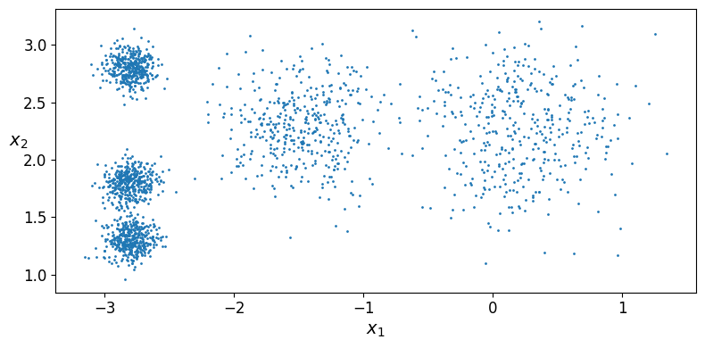 | 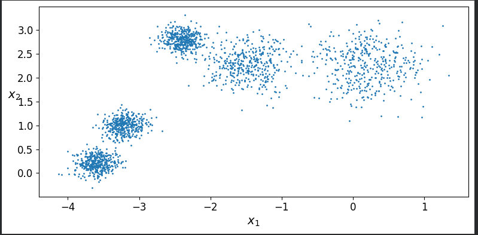 |

### 3.2 Diagrama de Voronoi (k = 5)

| Antes | Después |
|---|---|
| 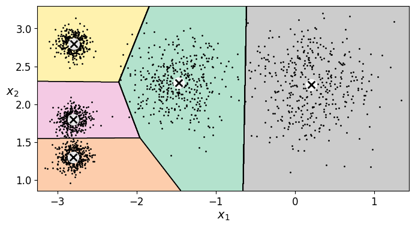 | 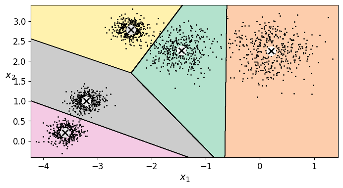 |

### 3.3 Curva de inercia (codo)

| Antes | Después |
|---|---|
|  | 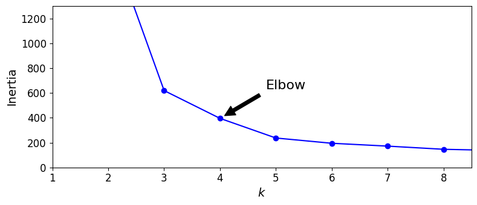 |

### 3.4 Curva de silueta

| Antes | Después |
|---|---|
| 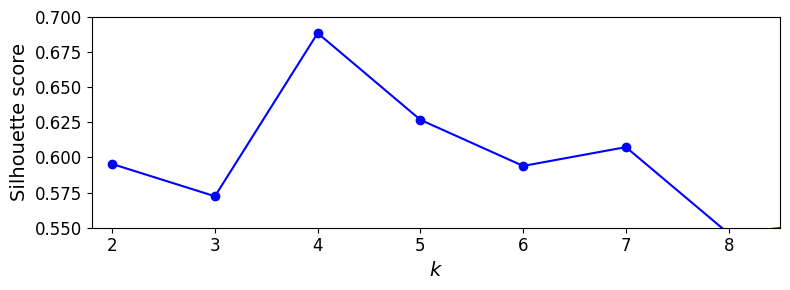 | 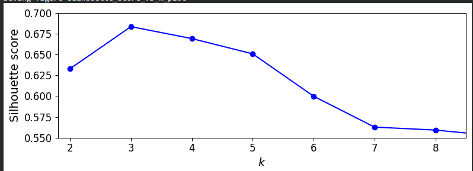 |


## 4. Reporte (media página)

### 4.1 ¿Por qué el codo "prefiere" k = 4 en los datos de Géron si `make_blobs` usó 5 centros?

El codo "prefirió" k=4 porque en los datos de Gerón los 3 centros que están en x=-2.8 eran muy cercanos, y apenas superaban el umbral para ser considerados diferentes grupos, señalado por la fórmula `2(σᵢ+σⱼ)`. Al poner un centroide compartido estos tenían un std de 0.1, por lo que los puntos estaban muy compactos, por lo que la inercia no tuvo un cambio grande al pasar de k=4 a k=5. Por eso el codo notorio fue k=4.

### 4.2 Con tus blobs separados, ¿el codo y la silueta coinciden en el mismo k? ¿Ese k es 5?

No coinciden, el k con el punto más alto en la silueta fue el k=3, esto quiere decir que con los nuevos datos pasó de k=4 a k=3, con respecto al codo, se mantuvo en k=4 pero se puede ver una diferencia en el salto entre las diferencias de inercia que el ritmo empieza a disminuir de k=4 a k=5, lo cual es distinto con los datos originales.

### 4.3 Si el codo sigue en 4, ¿qué te falta mover (distancia entre centros vs. `blob_std`)?

Para poder tener un k=5, lo que se puede hacer es cambiar la distancia entre los centros, con esto el máximo de la silueta debería caer en 5 y el codo debería coincidir, ya que en k<5 debería dispararse la inercia al tener una mayor distancia hacia el centroide compartido. Para esto, se decidió mover los centros de los últimos 3 blobs para que tengan una mayor distancia entre ellas.

```python
blob_centers = np.array(
    [[ 0.2,  2.3],
     [-1.5,  2.3],
     [-2.8,  3.5],
     [-4.0,  1.8],
     [-2.0,  0.3]])
blob_std = np.array([0.4, 0.3, 0.15, 0.15, 0.15])
```

En las siguientes imágenes, podemos observar que al cambiar la distancia sí fue posible hacer que el codo y la silueta coincidieran en el mismo k:


| Scatter | Voronoi (k=5) |
|---|---|
| 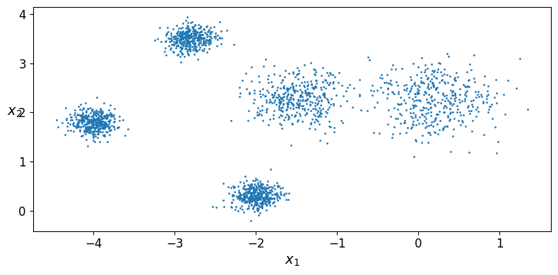 | 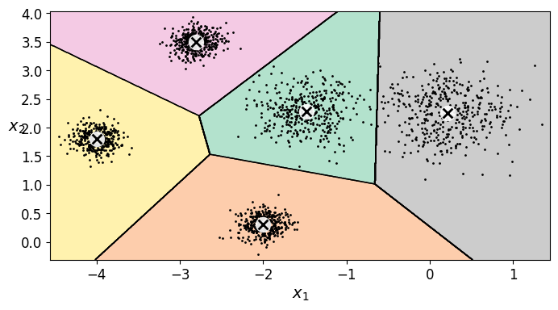 |

| Codo | Silueta |
|---|---|
| 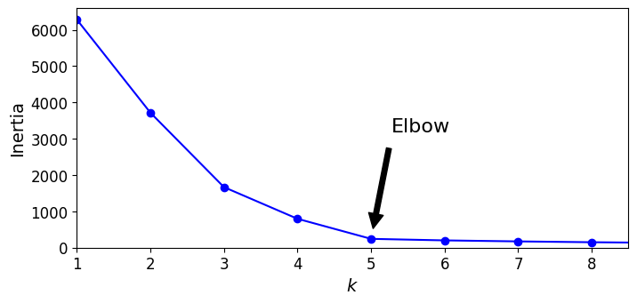 | 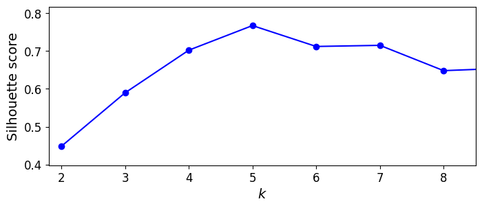 |

## 5. Evidencia de ejecución en Colab

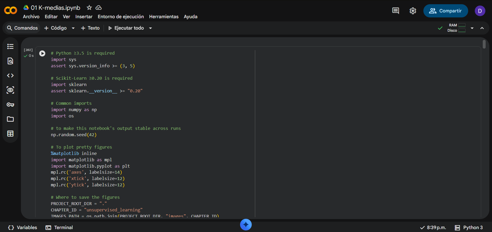
